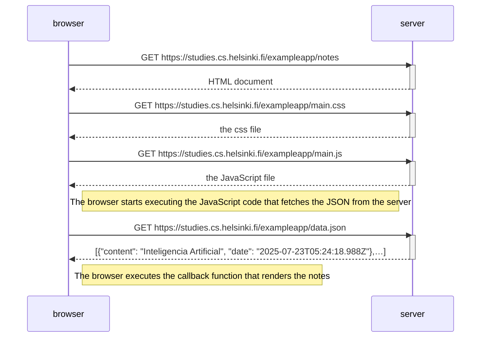

Here is the example given for reference:

```mermaid
sequenceDiagram
    participant browser
    participant server

    browser->>server: GET https://studies.cs.helsinki.fi/exampleapp/notes
    activate server
    server-->>browser: HTML document
    deactivate server

    browser->>server: GET https://studies.cs.helsinki.fi/exampleapp/main.css
    activate server
    server-->>browser: the css file
    deactivate server

    browser->>server: GET https://studies.cs.helsinki.fi/exampleapp/main.js
    activate server
    server-->>browser: the JavaScript file
    deactivate server

    Note right of browser: The browser starts executing the JavaScript code that fetches the JSON from the server

    browser->>server: GET https://studies.cs.helsinki.fi/exampleapp/data.json
    activate server
    server-->>browser: [{"content": ";-;", "date": "2025-07-23T05:09:35.229Z"},…]
    deactivate server

    Note right of browser: The browser executes the callback function that renders the notes
```

Exercise 0.4:

```mermaid
sequenceDiagram
    participant browser
    participant server

    browser->>server: POST https://studies.cs.helsinki.fi/exampleapp/new_note
    activate server
    Note right of browser: POST request data is sent as the body of the req (i.e. req.body)
    Note right of browser: Code on the server processes the POST request, creating a new node object and adding it to notes, before redirecting
    server-->>browser: HTTP status code 302
    deactivate server
    Note right of browser: URL redirect

    browser->>server: GET https://studies.cs.helsinki.fi/exampleapp/notes
    activate server
    server-->>browser: HTML document
    deactivate server

    browser->>server: GET https://studies.cs.helsinki.fi/exampleapp/main.css
    activate server
    server-->>browser: the css file
    deactivate server

    browser->>server: GET https://studies.cs.helsinki.fi/exampleapp/main.js
    activate server
    server-->>browser: the JavaScript file
    deactivate server

    Note right of browser: The browser starts executing the JavaScript code that fetches the JSON from the server

    browser->>server: GET https://studies.cs.helsinki.fi/exampleapp/data.json
    activate server
    server-->>browser: [{"content": ";-;", "date": "2025-07-23T05:09:35.229Z"},…]
    deactivate server

    Note right of browser: The browser executes the callback function that renders the notes
```

Exercise 0.5:



Exercise 0.6:


